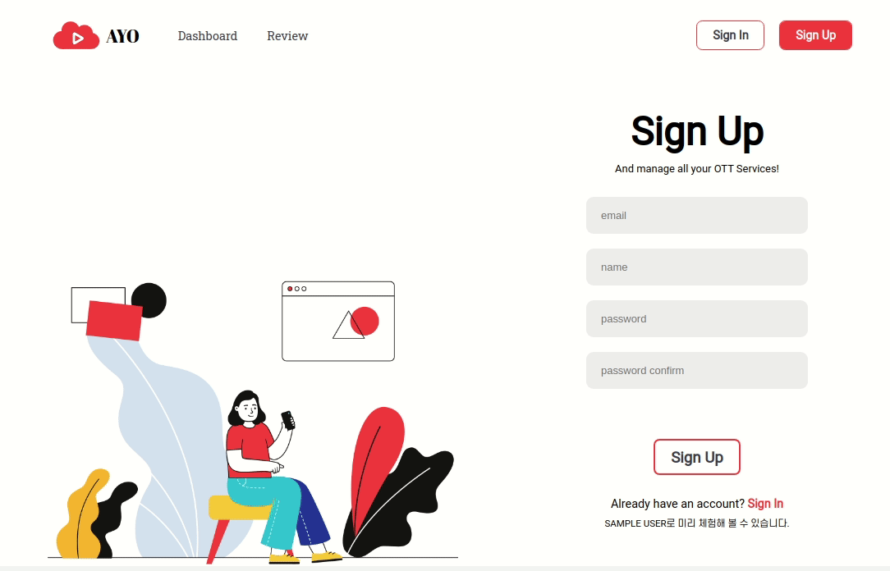

<p align="center">
  <a href="https://ayo.devhak.com">
    
  </a>
</p>
<h1 align="center"><a href="https://ayo.devhak.com">AYO(All Your OTT)</a></h1>

[](https://app.netlify.com/sites/all-your-ott/deploys)

## Introduction

**AYO(All Your OTT)** 는 영화/TV 프로그램 컨텐츠에 대하여 리뷰를 기록하고, 리뷰를 바탕으로 전체적인 서비스 통계를 제공하는 웹 어플리케이션입니다.

### 미리보기


<details>
   <summary>미리보기 더 보기</summary>

   #### 반응형 웹
   

   #### Dashboard
   

   #### 회원가입 & 로그인
   
   </details>

## Contents

1. [Requirements](#Requirements)
2. [Installation](#Installation)
3. [Features](#Features)
4. [Skills](#Skills)
5. [Test](#Test)
6. [Deployment](#Deployment)
7. [Version Control](#Version-Control)
8. [Challenges](#Challenges)
9. [Things to Do](#Things-to-Do)

---

## Requirements

- Chrome Browser를 권장합니다.
- Database 주소가 있어야 합니다.
- Local에서 작동시 TMDb Key를 필요로 합니다. (참고: https://www.themoviedb.org/)


## Installation

### Client

```javascript
git clone https://github.com/hakyung-dev/all-your-ott-client
cd all-your-ott-client
npm install
npm run dev
```

### Server

```javascript
git clone https://github.com/hakyung-dev/all-your-ott-server
cd all-your-ott-server
npm install
npm run dev
```

#### Environment Variables

- dotenv로 환경변수 관리 [(참조)](https://github.com/motdotla/dotenv)
- Server 루트 디렉토리에 `.env` 파일 생성
- 하단의 변수와 발급받은 값 추가
```
JWT_SECRET=YOUR SECRET WORD
DB_URL=YOUR DATABASE URL
TMDB_KEY=YOUR TMDB KEY
```
- Client 환경 변수는 SAMPLE 유저 로그인을 할 때만 사용되므로 필수적이진 않습니다.
- 만약 해당 버튼을 사용하고 싶다면, Client 루트 디렉토리에 `.env` 파일 생성 후 하단에 가입된 변수를 작성
```
REACT_APP_SAMPLE_EMAIL=가입 완료한 이메일
REACT_APP_SAMPLE_PASSWORD=위와 맞는 비밀번호
```

## Features

1. 회원 관리
   - 다양한 Validation을 설정하여 회원가입
   - JSON Web Token(JWT)을 이용한 사용자 인증
   - localStorage 통한 로그인 유지
   - Sign In 페이지 SAMPLE USER 자동 로그인

2. Review
   - TMDb Open API를 이용하여 영화 및 TV프로그램 검색
   - 검색 결과 pagination
   - 해당 컨텐츠에 대한 리뷰 작성 가능
   - date-fns를 이용하여 달력을 구현하고 리뷰표시
   - 리뷰 목록에서 리뷰 삭제 기능
   - 리뷰 개별 페이지에서 TMDb Open API를 이용하여 미디어 자료 등 컨텐츠의 자세한 정보 제공

3. Dashboard
   - 구독중인 서비스 등록, 삭제 기능
   - Chart.js를 통한 다양한 그래프 표현
   - 작성된 리뷰를 바탕으로 이용량, 만족도 등의 통계 자료표현


## Skills

### Client-Side

- ES2015+
- 컴포넌트 기반 아키텍쳐를 위한 React
- Redux를 이용한 State 관리
- React Router
- Axios
- TMDb API 오픈 API : 컨텐츠 정보
- Sass(Scss)

### Server-Side

- ES2015+
- Node.js
- Express.js를 이용한 RESTful API 설계
- Bcrypt(bcryptjs)를 이용한 암호화
- MongoDB 기반 NoSQL Database
- Object Data Modeling 라이브러리 Mongoose


## Test

### Unit Test

- Jest를 이용한 Reducer Test
- Jest와 Enzyme을 이용한 Component Test
- `npm test`시 Unit Test 실행

### End to End Test

- Cypress 이용
- `npm run cypress`시 End to End Test 실행


## Deployment

### Client-Side

- Netlify를 통한 배포 자동화

### Server-Side

- AWS Elastic Beanstalk을 통한 서버 배포


## Version Control

- GitHub
- Trello를 이용한 Task Management


## Challenges

- JWT을 이용하여 사용자 인증 절차를 진행하며 로컬 로그인을 구현했는데, 이를 통해 토큰 기반 인증에 관해 공부할 수 있었습니다. JWT의 구조 및 특징을 바탕으로 토큰 기반 인증의 원리와 장점들을 전반적으로 알 수 있었고 또한 세션에 관해 공부할 수 있었습니다. 그리고 비밀번호 같은 민감한 정보들을 어떻게 저장해야 하는지 고민하게 되었고, bcrypt를 사용하여 서버에 저장하기 전에 미리 해싱하여 보안성을 높일 수 있었습니다.
- 구현해야할 달력은 컨텐츠의 포스터를 포함해야 했습니다. 포스터를 잘 나타내기 위해선 일정한 비율의 직사각형을 유지해야했습니다. 절대적인 값으로 사이즈를 정하면 편했겠지만, 반응형 웹으로 제작을 하다보니 그럴 수 없었습니다. 너비는 grid를 사용하여 비교적 쉽게 반응형으로 제작할 수 있었는데, 계속 변하는 너비에 따라 비율이 정해져야 하는 높이가 문제였습니다. 이는 `:after`를 사용하여 가상 요소를 통해 가상요소의 padding-top(bottom)에 상대적 단위인 %값을 주어 해결하였습니다. padding은 부모 요소의 width를 기준으로 움직이기 때문에, 모바일 웹에서도 일정환 비율을 유지할 수 있도록 만들 수 있었습니다.
- TMDb OPEN API를 통해 받은 데이터를 다시 다른 API에 넣어서 다른 정보를 얻어야 하는 과정을 거쳐야만 했습니다. 여러 API를 차례대로 사용했어야 했는데, 그 과정에서 비동기에 대해 좀 더 자세히 공부하는 기회가 되었습니다. 특히 `fetch`와 `then` 대신에 `async`와 `await`을 사용하고, Axios가 `Promise`를 리턴한다는 것을 이용하여 좀 더 간결한 코드를 완성 할 수 있었습니다.
- 데이터를 Chart.js를 비롯한 다양한 페이지에서 활용하기 위해 저장하는 형태가 중요했습니다. 원하는 그래프의 자료 형태에 맞춰 따로 따로 저장하기에는 비효율적이기 때문에 Review와 User 모델만 Schema를 구성하고 필요시에 데이터를 따로 정리하여 화면을 구성하였습니다. 특히 AYO에서는 회원을 기반으로 운영되므로, User의 my_review에 Review 데이터의 ObjectId를 추가하는 형태로 구성하였습니다. 좀 더 효율적인 데이터 저장 형태가 무엇인지 고민해 보는 기회였습니다.


## Things to Do

- ~~SAMPLE USER 자동 로그인~~ DONE!
- 컴포넌트 재사용을 위한 리팩토링
- 통합 테스트 작성
- 더 다양한 형태의 통계 그래프
